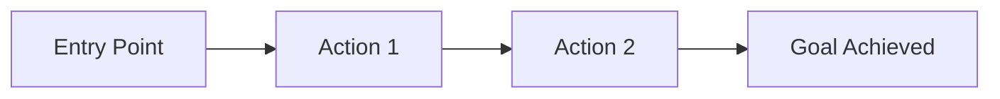
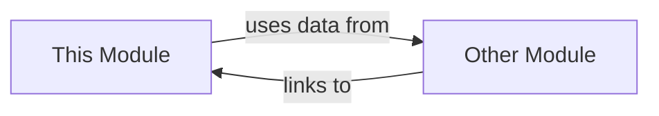

# Module Brain-Dump: `<module-name>`

> This document serves as the persistent product context for the `<module-name>` module.
> Every PM agent MUST read this file before drafting any change for this module.
> Updates to this file are driven by OpenSpec changes — when a new capability is added,
> modified, or removed, the corresponding section here must be updated.

---

## 1. Users and Value

### User Persona
<!-- Who uses this module? Be specific. -->

### Pain Points
<!-- What problems do they face without this module? -->

### Alternatives They Use Today
<!-- What do they do instead? -->

### Core Value Proposition
<!-- One sentence: what unique value does this module provide? -->

---

## 2. User Journey

<!-- Describe the primary user flow through this module. -->

---

## 3. Current Capabilities

| Capability | Spec | User-Facing Description |
|-----------|------|------------------------|
| `<capability-name>` | [spec](openspec/specs/<capability>/spec.md) | `<description>` |

<!-- List every capability that belongs to this module.
     Link each to its OpenSpec spec file.
     If a capability is not yet specced, mark as "🚧 Future". -->

---

## 4. Red Lines and Anti-Goals

<!-- At least 3 explicit "we will NOT do" statements.
     These are hard constraints for PM agents when drafting changes. -->

1. **`<anti-goal>`**: `<explanation>`
2. **`<anti-goal>`**: `<explanation>`
3. **`<anti-goal>`**: `<explanation>`

---

## 5. Priority Principles

<!-- When resources are limited, how do we decide what to build first? -->

1. `<principle>`
2. `<principle>`
3. `<principle>`

---

## 6. Known Gaps / Tech Debt / Wishlist

| Item | Severity | Notes |
|------|----------|-------|
| `<gap>` | 🔴 High / 🟡 Medium / 🟢 Low | `<description>` |

<!-- Track things we know are missing or could be better.
     This prevents PM agents from repeatedly "discovering" the same gaps. -->

---

## 7. Interfaces with Other Modules

<!-- Data, page, and event dependencies between this module and others.
     Use a dependency graph or table. -->

| Dependency | Direction | Details |
|-----------|-----------|---------|
| `<module>` | This → Other / Other → This / Bidirectional | `<description>` |

---

## 8. Decision Log

| Date | Decision | Context | Reversible? |
|------|----------|---------|-------------|
| YYYY-MM-DD | `<decision>` | `<why>` | Yes / No |

<!-- Record significant product/technical decisions so future PMs
     understand why things are the way they are. -->

---

## Deliberately Omitted

The following sections were intentionally excluded from the first version of this template:

- **Roadmap**: Changes too fast, easily becomes stale. Use OpenSpec changes as the living roadmap.
- **KPI / Metrics**: No analytics infrastructure in place yet. Add when data pipeline is ready.
- **Competitor Analysis**: Not critical for MVP phase. Revisit when positioning strategy is needed.
