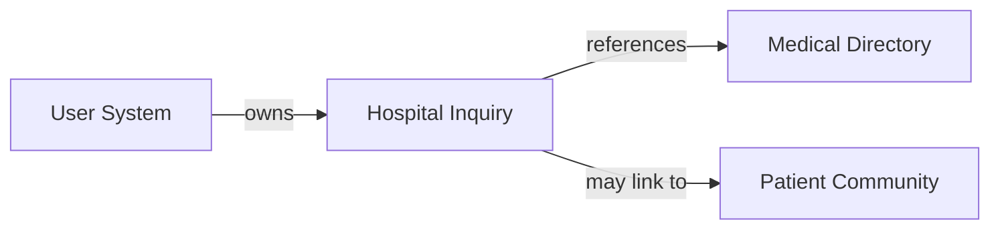

# Module Brain-Dump: `hospital-inquiry`

> This document serves as the persistent product context for the `hospital-inquiry` module.
> Every PM agent MUST read this file before drafting any change for this module.
> Updates to this file are driven by OpenSpec changes — when a new capability is added,
> modified, or removed, the corresponding section here must be updated.

---

## 1. Users and Value

### User Persona
- **Primary**: Foreign patients who want to contact a hospital's international department before visiting
- **Secondary**: Family members arranging care on behalf of a patient
- **Tertiary**: Company HR/benefits coordinators seeking bulk information about hospital services

### Pain Points
- Calling a Chinese hospital from abroad is difficult (time zones, language barriers)
- Hospital websites often lack English contact forms or clear international department info
- Email inquiries go unanswered or receive auto-replies in Chinese
- No way to track or follow up on inquiry status

### Alternatives They Use Today
- Direct phone calls (language barrier, time zone issues)
- Email to hospital generic addresses (low response rate)
- Medical tourism intermediaries (expensive, opaque)
- Insurance company concierges (only if they have premium coverage)

### Core Value Proposition
A structured, trackable inquiry system that connects foreign patients with hospital international departments — bridging the communication gap with clear forms, status tracking, and follow-up reminders.

---

## 2. User Journey

```mermaid
graph LR
    A[View Hospital Detail] --> B[Click "Submit Inquiry"]
    B --> C[Fill Inquiry Form]
    C --> D[Submit]
    D --> E[View in "My Inquiries"]
    E --> F[Receive Response / Follow Up]
```

```mermaid
graph LR
    A[Go to "My Inquiries"] --> B[View Inquiry List]
    B --> C[Check Status / Read Response]
    C --> D[Reply or Close]
```

---

## 3. Current Capabilities

| Capability | Spec | User-Facing Description |
|-----------|------|------------------------|
| Inquiry Submission | [inquiry](openspec/specs/inquiry/spec.md) | Submit structured inquiry to a hospital's international department |
| My Inquiries | [inquiry](openspec/specs/inquiry/spec.md) | View list of submitted inquiries with status |
| Inquiry Detail | [inquiry](openspec/specs/inquiry/spec.md) | View full inquiry thread and hospital response |
| Inquiry Status Tracking | 🚧 Partial | Basic status: Submitted → Under Review → Responded → Closed |

---

## 4. Red Lines and Anti-Goals

1. **No Booking/Scheduling**: We do NOT handle appointment bookings. Inquiries are for information-gathering only. The hospital handles scheduling separately.

2. **No Medical Triage**: We do NOT attempt to route inquiries to the "right" department using AI or rules. The hospital's international department handles routing.

3. **No Payment Processing**: We do NOT collect deposits, consultation fees, or any payments. All financial transactions happen directly between patient and hospital.

4. **No Intermediary/Markup**: We do NOT act as a medical tourism agent. We don't charge hospitals for leads or patients for access. The platform is neutral infrastructure.

---

## 5. Priority Principles

1. **Clarity over Speed**: A well-structured inquiry that gets a clear response in 48 hours is better than an instant auto-reply that says "we'll get back to you."

2. **Hospital-Friendly**: The inquiry system must be easy for hospital staff to receive and respond to. If hospitals don't engage, the feature is worthless.

3. **Audit Trail**: Every inquiry and response is logged and visible to the user. No "lost in the system" feeling.

4. **Mobile-First**: Users may submit inquiries while researching on their phones. Form must be thumb-friendly and not require desktop.

---

## 6. Known Gaps / Tech Debt / Wishlist

| Item | Severity | Notes |
|------|----------|-------|
| No email notification to hospitals | 🔴 High | Hospital staff are not notified when an inquiry arrives. They must check a dashboard (which doesn't exist yet). |
| No hospital admin dashboard | 🔴 High | Hospitals cannot view/respond to inquiries through any interface. Currently backend-only. |
| No email notification to users | 🟡 Medium | Users are not notified when a hospital responds. Must manually check "My Inquiries." |
| No inquiry templates | 🟡 Medium | Users write free-form inquiries. Common question templates would improve inquiry quality. |
| No auto-translation | 🟡 Medium | Inquiries are in English; hospital staff may prefer Chinese. Bilingual thread would help. |
| No attachment support | 🟢 Low | Cannot attach medical records, insurance cards, etc. |
| No inquiry analytics | 🟢 Low | No data on response rates, average response time, most-inquired hospitals. |

---

## 7. Interfaces with Other Modules



| Dependency | Direction | Details |
|-----------|-----------|---------|
| Medical Directory | HI → MD | Every inquiry is tied to a specific hospital from the directory. Hospital detail page has "Submit Inquiry" CTA. |
| User System | US → HI | Inquiries are user-scoped. "My Inquiries" page lists only the current user's inquiries. |
| Patient Community | 🚧 None yet | Potential: successful inquiries could become story prompts ("How was your experience at X hospital?") |

---

## 8. Decision Log

| Date | Decision | Context | Reversible? |
|------|----------|---------|-------------|
| 2025-05 | Inquiry is per-hospital, not per-department | Simpler data model; international department handles routing internally | Yes — can add department-level inquiries |
| 2025-05 | No real-time chat | Async inquiry fits hospital workflow better; real-time chat requires staffing | Yes — can add chat later |
| 2025-05 | Status: Submitted → Under Review → Responded → Closed | Simple lifecycle; covers 90% of use cases | Yes — can add more granular statuses |
| 2025-05 | No payment integration | Keeps platform neutral; avoids regulatory complexity | No — permanent architectural boundary |
