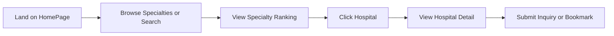
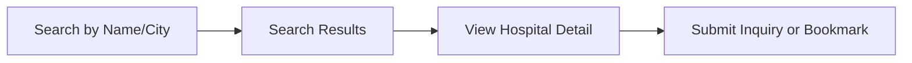
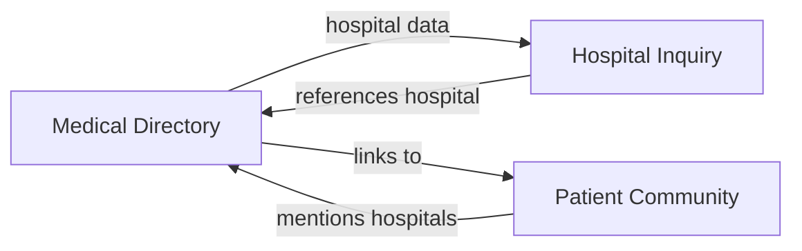

# Module Brain-Dump: `medical-directory`

> This document serves as the persistent product context for the `medical-directory` module.
> Every PM agent MUST read this file before drafting any change for this module.
> Updates to this file are driven by OpenSpec changes — when a new capability is added,
> modified, or removed, the corresponding section here must be updated.

---

## 1. Users and Value

### User Persona
- **Primary**: English-speaking expats and international residents in China seeking medical care
- **Secondary**: Medical tourists researching hospitals before travel
- **Tertiary**: HR/benefits coordinators at multinational companies building healthcare provider lists

### Pain Points
- Difficulty finding English-friendly hospitals in China
- No centralized, trustworthy source for hospital quality rankings
- Language barriers when browsing Chinese hospital websites
- Uncertainty about which hospital specializes in which discipline

### Alternatives They Use Today
- Word-of-mouth from colleagues/friends
- Random Google searches in English (yielding outdated or sparse info)
- Chinese apps like 好大夫 / 丁香园 (language barrier, account required)
- Company-provided insurance directories (often incomplete)

### Core Value Proposition
Curated, English-language hospital directory with authoritative specialty rankings and verified contact details — the fastest way for foreigners to find the right hospital in China.

---

## 2. User Journey

Alternative journey:

---

## 3. Current Capabilities

| Capability | Spec | User-Facing Description |
|-----------|------|------------------------|
| Hospital Search | 🚧 Future — needs spec | Search hospitals by name, city, or specialty with pagination |
| Specialty Ranking | 🚧 Future — needs spec | View top hospitals per specialty based on Fudan Hospital Rankings 2023 |
| Hospital Detail | 🚧 Future — needs spec | View detailed hospital info: address, phone, departments, international department availability |
| SEO / Sitemap | [seo-meta-tags](openspec/specs/seo-meta-tags/spec.md) | All pages have Helmet meta tags, JSON-LD structured data, sitemap.xml |
| Environment Config | [env-config-isolation](openspec/specs/env-config-isolation/spec.md) | JWT secret, CORS, site URL externalized via application.yaml |

<!-- NOTE: These capabilities were implemented before the spec-driven workflow was fully
     established. They need retroactive specs per the "change-driven spec backfill" policy. -->

---

## 4. Red Lines and Anti-Goals

1. **No Real-Time Availability**: We do NOT show real-time doctor availability, appointment slots, or queue times. This requires hospital system integrations we don't have.

2. **No Medical Advice**: We do NOT provide diagnosis, treatment recommendations, or medical advice. We are a directory, not a telehealth platform.

3. **No Booking/Scheduling**: We do NOT handle appointment bookings. We may link to hospital booking pages, but never embed a booking flow.

4. **No User-Generated Hospital Reviews**: We do NOT allow users to rate/review hospitals. Rankings come from authoritative sources (Fudan) only. Community discussions are fine, but not tied to hospital star ratings.

---

## 5. Priority Principles

1. **Authority over Completeness**: A smaller directory of verified, high-quality hospitals is better than a large directory of questionable entries.

2. **English-First UX**: Every piece of user-facing content must be in clear, professional English. Chinese names are secondary (shown for reference).

3. **Mobile-First**: Most users will access this on mobile. Layout and interactions must work flawlessly on small screens.

4. **SEO Is a Feature**: Being discoverable via Google is core to our value prop. SEO optimizations are first-class requirements, not afterthoughts.

---

## 6. Known Gaps / Tech Debt / Wishlist

| Item | Severity | Notes |
|------|----------|-------|
| Hospital data is seed-only (H2) | 🔴 High | No admin interface to add/edit hospitals. Every new hospital requires a Flyway migration + redeploy. |
| No hospital photos | 🟡 Medium | Detail page has no visual assets. Users want to see what the facility looks like. |
| Specialty ranking data is static (2023) | 🟡 Medium | Fudan rankings update annually. No automated refresh mechanism. |
| No filter by "accepts international insurance" | 🟡 Medium | Highly requested by expat users. Requires data model change. |
| Search is basic keyword match | 🟢 Low | No fuzzy search, no synonyms (e.g. "cardiology" vs "heart"). Postgres text search could help. |
| No multi-language support | 🟢 Low | Currently English-only. Chinese, Japanese, Korean expansion possible. |

---

## 7. Interfaces with Other Modules

| Dependency | Direction | Details |
|-----------|-----------|---------|
| Hospital Inquiry | MD → HI | Hospital detail page has "Submit Inquiry" CTA that creates an inquiry in the inquiry module |
| Patient Community | Bidirectional | Community posts can mention/tag hospitals; hospital detail may show related community discussions (future) |
| User System | HI → MD | User bookmarks/favorites are stored per-hospital |

---

## 8. Decision Log

| Date | Decision | Context | Reversible? |
|------|----------|---------|-------------|
| 2025-05 | Use Fudan Hospital Rankings 2023 as authoritative source | Most trusted public ranking in China; no licensing cost | Yes — can switch to other sources |
| 2025-05 | H2 in-memory database for MVP | Zero infrastructure cost; sufficient for demo/early stage | Yes — can migrate to Postgres/MySQL |
| 2025-05 | Seed data via Flyway migrations | Simple, version-controlled; no admin UI needed for MVP | Yes — will need admin panel at scale |
| 2025-05 | English-first, Chinese secondary | Target audience is foreigners in China | No — core brand positioning |
| 2025-05 | No user reviews for hospitals | Authority/trust positioning; avoid moderation burden | Yes — can add later with strict moderation |
| 2025-05-21 | Externalize JWT/CORS/site-url config | Security best practice; enables per-environment deployment | No — permanent architecture decision |
