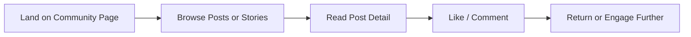
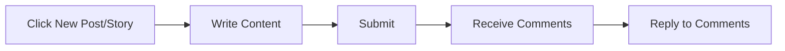
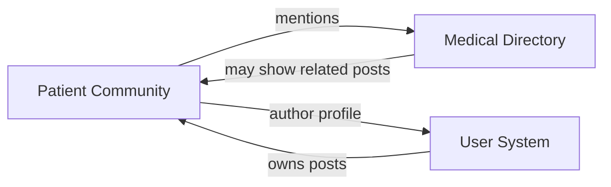

# Module Brain-Dump: `patient-community`

> This document serves as the persistent product context for the `patient-community` module.
> Every PM agent MUST read this file before drafting any change for this module.
> Updates to this file are driven by OpenSpec changes — when a new capability is added,
> modified, or removed, the corresponding section here must be updated.

---

## 1. Users and Value

### User Persona
- **Primary**: Foreign patients who have undergone treatment in China and want to share experiences
- **Secondary**: New arrivals researching healthcare options through peer stories
- **Tertiary**: Family members of patients seeking emotional support and practical advice

### Pain Points
- Feeling isolated in a foreign medical system
- No trusted peer-to-peer platform for sharing hospital experiences in English
- Difficulty finding "human" perspectives beyond official hospital marketing
- Language barriers on Chinese health forums

### Alternatives They Use Today
- Facebook/WeChat expat groups (scattered, hard to search, not healthcare-focused)
- Reddit r/China (too broad, medical questions get buried)
- Chinese forums like 小红书 (language barrier, different cultural context)
- Word-of-mouth only (not scalable, not searchable)

### Core Value Proposition
A safe, moderated, English-language community where foreign patients share authentic healthcare experiences in China — turning isolated anecdotes into a collective knowledge base.

---

## 2. User Journey

Content creator journey:

---

## 3. Current Capabilities

| Capability | Spec | User-Facing Description |
|-----------|------|------------------------|
| Community Posts | [community-posts](openspec/specs/community-posts/spec.md) | Create, read, list text-based discussion posts |
| Patient Stories | 🚧 Partial — merged with posts | Long-form patient journey stories with dedicated card UI |
| Comments | [community-comments](openspec/specs/community-comments/spec.md) | One-level nested comments on posts (no threading) |
| Interactions | [community-interactions](openspec/specs/community-interactions/spec.md) | Like/unlike posts; view like counts |
| User Auth | [mock-users](openspec/specs/mock-users/spec.md) | Registration, login, JWT-based sessions (migrated to real auth) |

---

## 4. Red Lines and Anti-Goals

1. **No Paywall**: Community content is and will remain free. No premium tiers, no gated content, no "members-only" posts.

2. **No Anonymous Abuse**: All interaction requires authentication. No anonymous posting, no anonymous commenting. Accountability is enforced.

3. **No Clinical Advice from Peers**: Users can share experiences ("I went to X hospital and Y happened"), but cannot give medical advice ("You should take Z medication"). The platform is not a substitute for professional medical consultation.

4. **No Self-Promotion / Spam**: Hospitals, clinics, and medical tourism agencies cannot use the community for marketing. All promotional content is removed.

5. **No Photo/Video Uploads (MVP)**: Text-only posts and stories. Media uploads introduce moderation complexity and storage costs we are not ready for.

---

## 5. Priority Principles

1. **Safety over Scale**: A small, trusted community is better than a large, toxic one. Moderation is a feature, not an afterthought.

2. **Authenticity over Polish**: Raw, honest patient stories are more valuable than professionally edited content. Don't over-design the writing experience.

3. **Searchability**: Content must be discoverable via Google and internal search. Good SEO and clear categorization are essential.

4. **Mobile-First Creation**: Users will write posts on their phones while at the hospital or recovering at home. The editor must be thumb-friendly.

---

## 6. Known Gaps / Tech Debt / Wishlist

| Item | Severity | Notes |
|------|----------|-------|
| No moderation UI | 🔴 High | No admin interface to review/remove posts. Currently manual DB access. |
| No content reporting | 🔴 High | Users cannot report abusive/inappropriate posts. |
| No post categories/tags | 🟡 Medium | All posts in one feed. Hard to find relevant content. |
| No search within community | 🟡 Medium | Cannot search posts by keyword. |
| No "mention hospital" linking | 🟡 Medium | Users type hospital names free-form; no auto-link to directory entries. |
| No notification system | 🟡 Medium | No push/email when someone replies to your post. |
| No draft autosave | 🟢 Low | Losing a half-written post is frustrating. |
| No rich text / markdown | 🟢 Low | Plain text only. Bold, links, lists would improve readability. |

---

## 7. Interfaces with Other Modules

| Dependency | Direction | Details |
|-----------|-----------|---------|
| Medical Directory | PC → MD | Community posts can mention/tag hospitals (future). Hospital detail may show related community discussions (future). |
| User System | Bidirectional | Every post/story/comment is tied to a user account. User profile shows their posts. |
| Hospital Inquiry | 🚧 None yet | Potential: community discussions could surface common questions that become inquiry templates |

---

## 8. Decision Log

| Date | Decision | Context | Reversible? |
|------|----------|---------|-------------|
| 2025-05 | One-level nested comments only | Threading adds complexity; most conversations don't need deep nesting | Yes — can add threading later |
| 2025-05 | Separate "Stories" from "Posts" | Stories are long-form, emotional, evergreen. Posts are short, timely, discussion-oriented. | Yes — can merge if overlap is high |
| 2025-05 | Text-only MVP | Avoids moderation nightmares with images; reduces storage cost | Yes — media uploads are a natural next step |
| 2025-05 | "Hot" sort by like count + recency | Simple engagement metric; no complex algorithm needed | Yes — can switch to more sophisticated ranking |
| 2025-05-19 | Real user auth replaces mock users | Mock users were for early demo; production needs real accounts | No — permanent |
